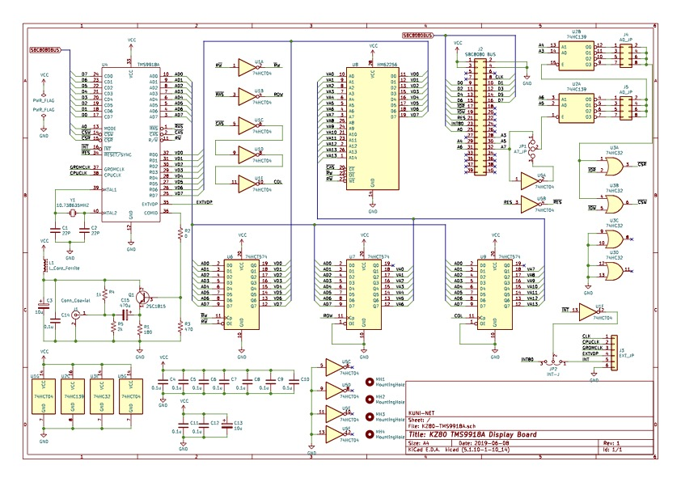

== KZ80シリーズ TMS9918A グラフィックボード

=== 概要
* SBC8080バスにつながるTMS9918Aグラフィックボードのプロジェクトです。
* ☆★ 試作検討段階です。参考までに御覧ください

=== ライセンス
* 本プロジェクトのデータはMITライセンスのもとで公開します。

=== 参考
* 以下のサイトの情報ー参考に作成しています。ありがとうございます。
** https://github.com/jblang/TMS9918A
** https://retrobrewcomputers.org/n8vem-pbwiki-archive/0/35845334/48860720/33053543/SRAM%20Replacement%20for%20TMS99x8%20VRAM.pdf
